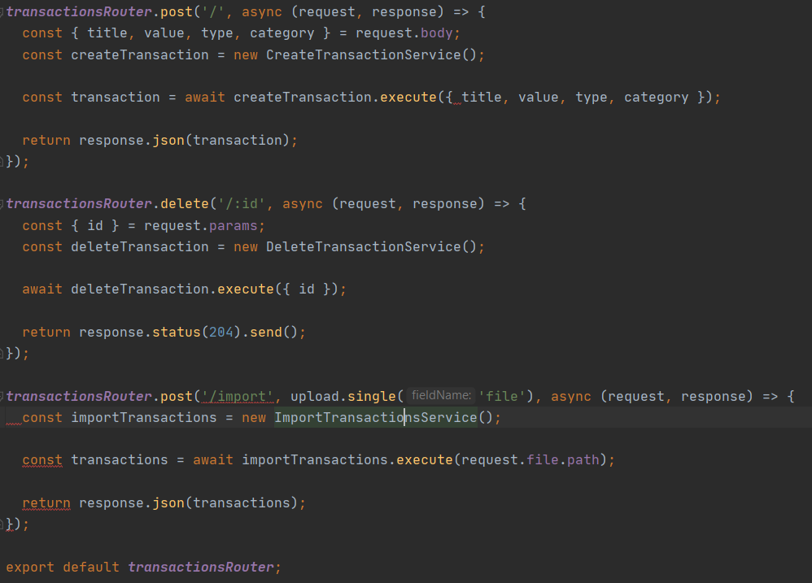
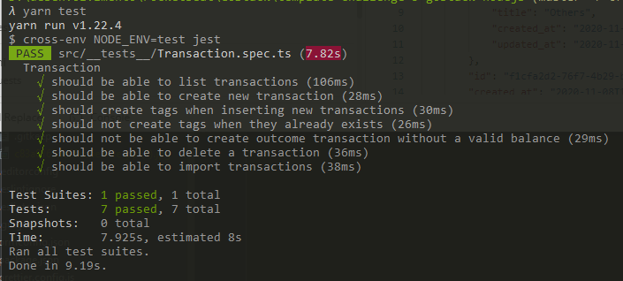

<p align="center">
  <a href="#rocket-tecnologias">Tecnologias</a>&nbsp;&nbsp;&nbsp;|&nbsp;&nbsp;&nbsp;
  <a href="#-projeto">Projeto</a>&nbsp;&nbsp;&nbsp;|&nbsp;&nbsp;&nbsp;
  <a href="#-como-rodar">Como rodar</a>&nbsp;&nbsp;&nbsp;|&nbsp;&nbsp;&nbsp;
  <a href="#-Rotas">Rotas</a>&nbsp;&nbsp;&nbsp;|&nbsp;&nbsp;&nbsp;
  <a href="#-como-contribuir">Como contribuir</a>&nbsp;&nbsp;&nbsp;
  </p>

<br>

<p align="center">
  
</p>

## GoStack - Quinto desafio NodeJs

## 🚀 Tecnologias

Esse projeto foi desenvolvido com as seguintes tecnologias:

- [NodeJS](https://nodejs.org/en/) - 0.63.3
- [Yarn](https://yarnpkg.com/) - 1.22.4
- [Npm](https://www.npmjs.com/) - 6.14.5
- [Docker](https://www.docker.com/) - 19.03.8


## 💻 Projeto

Uma API simples com banco de dados onde é possível executar a rota de listagem, exclusão, cadastro de transações.
Tambem é possível enviar um arquivo CSV para cadastrar e alterar categorias dessas transações.
O projeto recebe e retorna JSON.

Descrição do desafio [GoStack](https://github.com/rocketseat-education/bootcamp-gostack-desafios/tree/master/desafio-database-upload)


Resolulção do teste.
<p align="center">
  
</p>

## 👩🏿‍💻 Rotas

- **`POST /transactions`**: A rota deve receber title, value, type, e category dentro do corpo da requisição, sendo o type o tipo da transação, que deve ser income para entradas (depósitos) e outcome para saídas (retiradas). Ao cadastrar uma nova transação, ela deve ser armazenada dentro do seu banco de dados, possuindo os campos id, title, value, type, category_id, created_at, updated_at.
```
{
  "id": "uuid",
  "title": "Salário",
  "value": 3000,
  "type": "income",
  "category": "Alimentação"
}
```
- **`GET /transactions`**: Essa rota deve retornar uma listagem com todas as transações que você cadastrou até agora, junto com o valor da soma de entradas, retiradas e total de crédito. Essa rota deve retornar um objeto o seguinte formato:
```
{
  "transactions": [
    {
      "id": "uuid",
      "title": "Salário",
      "value": 4000,
      "type": "income",
      "category": {
        "id": "uuid",
        "title": "Salary",
        "created_at": "2020-04-20T00:00:49.620Z",
        "updated_at": "2020-04-20T00:00:49.620Z"
      },
      "created_at": "2020-04-20T00:00:49.620Z",
      "updated_at": "2020-04-20T00:00:49.620Z"
    },
    {
      "id": "uuid",
      "title": "Freela",
      "value": 2000,
      "type": "income",
      "category": {
        "id": "uuid",
        "title": "Others",
        "created_at": "2020-04-20T00:00:49.620Z",
        "updated_at": "2020-04-20T00:00:49.620Z"
      },
      "created_at": "2020-04-20T00:00:49.620Z",
      "updated_at": "2020-04-20T00:00:49.620Z"
    },
    {
      "id": "uuid",
      "title": "Pagamento da fatura",
      "value": 4000,
      "type": "outcome",
      "category": {
        "id": "uuid",
        "title": "Others",
        "created_at": "2020-04-20T00:00:49.620Z",
        "updated_at": "2020-04-20T00:00:49.620Z"
      },
      "created_at": "2020-04-20T00:00:49.620Z",
      "updated_at": "2020-04-20T00:00:49.620Z"
    },
    {
      "id": "uuid",
      "title": "Cadeira Gamer",
      "value": 1200,
      "type": "outcome",
      "category": {
        "id": "uuid",
        "title": "Recreation",
        "created_at": "2020-04-20T00:00:49.620Z",
        "updated_at": "2020-04-20T00:00:49.620Z"
      },
      "created_at": "2020-04-20T00:00:49.620Z",
      "updated_at": "2020-04-20T00:00:49.620Z"
    }
  ],
  "balance": {
    "income": 6000,
    "outcome": 5200,
    "total": 800
  }
}
```

- **`DELETE /transactions/:id`**: A rota deve deletar uma transação com o id presente nos parâmetros da rota;

- **`POST /transactions/import`**: A rota deve permitir a importação de um arquivo com formato .csv contendo as mesmas informações necessárias para criação de uma transação id, title, value, type, category_id, created_at, updated_at, onde cada linha do arquivo CSV deve ser um novo registro para o banco de dados, e por fim retorne todas as transactions que foram importadas para seu banco de dados.

| title | type | value | category |
|-------|------|-------|----------|
| Loan  | income | 1500 | Others |

## 🚀 Como Rodar

- Clone o projeto.
- Entre na pasta do projeto e rode yarn install (pode usar npm install de acordo com a sua configuração).
- Rode o comando docker run --name gostack_postgres -e POSTGRES_PASSWORD=docker -p 5432:5432 -d postgres
- Crei os bancos gostack_desafio06 e gostack_desafio06_tests.
- yarn test para rodar os testes.
- yarn yarn dev:server para rodar o projeto (localhost:3333).

## 🤔 Como contribuir

- Faça um fork desse repositório;
- Cria uma branch com a sua feature: `git checkout -b minha-feature`;
- Faça commit das suas alterações: `git commit -m 'feat: Minha nova feature'`;
- Faça push para a sua branch: `git push origin minha-feature`.

Depois que o merge da sua pull request for feito, você pode deletar a sua branch.

## 📝 Licença

Esse projeto está sob a licença MIT.
